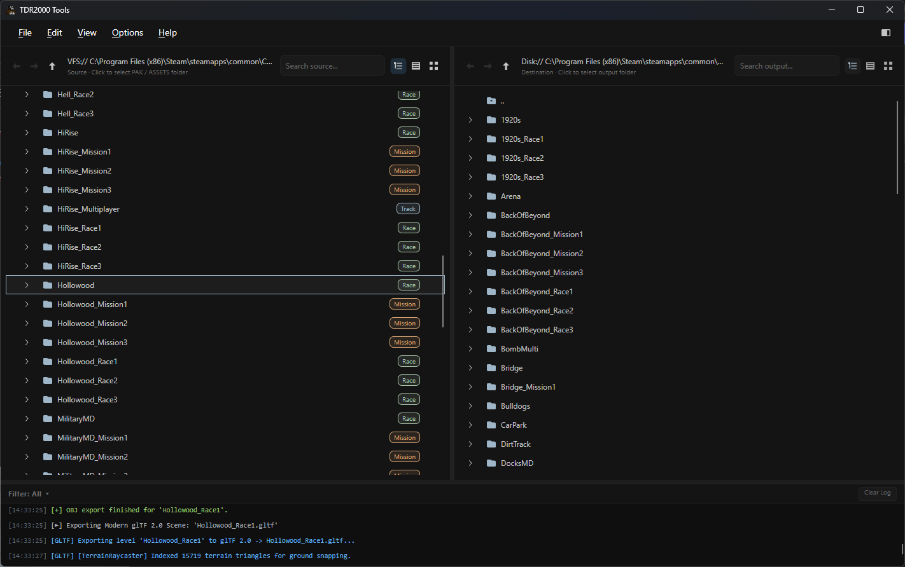
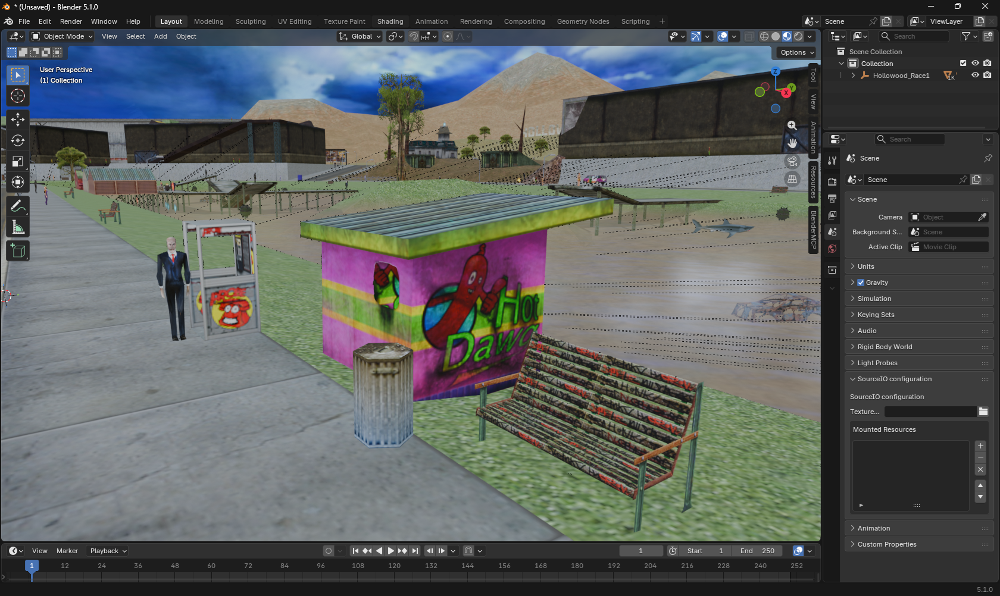

# TDR2000 Tools

> [!WARNING]
> **DEVELOPMENT BUILD**  
> This project is in active development. Formats, parsers, and export structures are subject to changes and refinements.

A desktop application and C# library for inspecting, extracting, and converting asset formats from **Carmageddon: TDR 2000**.

---

## Overview

`TDR2000 Tools` consists of a cross-platform desktop UI (Avalonia UI, .NET 10) and a modular library layer (`TDR.PakLib`, `TDR.Formats`) providing access to game archives, geometry data, descriptors, and audio resources.

<p align="center">
  
</p>

### Core Capabilities

- **Virtual File System (VFS):**
  - Reading and writing Trie-indexed `.DIR` directory headers.
  - Parsing `.PAK` containers with XOR keying and `zIG` (zlib) stream compression.

- **Geometry & Hierarchy Parsing:**
  - Node hierarchy trees and transform matrices (`.hie`).
  - Binary mesh containers with position, normal, UV, and polygon buffers (`.mshs`, `.msh`).
  - Skinned character meshes (`.ski`), skeletal armatures (`.ske`), and keyframe animations (`.ani`).
  - Road and drone spline networks (`.lin`, `.lins`), evaluated directly or via parent scene graph matrices (`*Drone_Paths.hie`).
  - Level asset descriptors (`.txt`), movables (`MoveableDescriptor.txt`), animated props, and powerup item placements (`.pup`).

- **Texture & Material Handling:**
  - Decoding 32-bit RGBA, 24-bit RGB, and 8-bit paletted TGA files.
  - PNG conversion with support for uncompressed alpha channels and zero-alpha recovery for legacy 32-bit textures.
  - Relief and bump map resolution (`map_Bump`).

- **Audio Playback:**
  - In-memory decoding and playback of PCM WAV/SND audio streams with looping and metadata inspection.

- **Export Formats:**
  - **Wavefront OBJ:** Merged geometry with `.mtl` material libraries and texture assets.
  - **glTF 2.0 / GLB:** Scene graph nodes, skinned character meshes with rigid FK armature and multi-animation tracks, directional/ambient lighting, and automated material alpha modes.
  - **JSON Manifest:** Structured scene metadata (`scene.json`) containing level definitions, weather, lighting parameters, and object lists.

<p align="center">
  
</p>

---

## User Interface

The application interface is divided into two primary panes and a dedicated export dialog:

1. **Explorer Pane (Left):**
   - VFS file hierarchy navigation (Tree View, Table List, or Card Grid).
   - Search filtering and path navigation controls.

2. **Inspector Pane (Right):**
   - **Image Preview:** Texture inspection for TGA and paletted image files.
   - **Audio Player:** Waveform audio playback controls with time tracking and looping.
   - **Archive & Container Inspector:** File count, size on disk, active payload volume, real-time fragmentation % (`Dead Space`), and rebuild/defragmentation recommendations.
   - **Properties:** File sizes, compression metadata, node structures, and container offsets.
   - **Log Console:** Session logging output with text selection and clipboard copying.

3. **Track Conversion Dialog:**
   - **Format Options:** Selectable outputs (`.OBJ`, `.gltf`, `scene.json`), texture conversion toggles, and coordinate modes (Local Coordinates, Ground Snapping).
   - **Resource Tree:** Checkable hierarchy tree allowing layer filtering (Base track, specific races, missions, or individual `.hie` files).

### Keybindings & Navigation

| Shortcut | Action | Description |
| :--- | :--- | :--- |
| `Ctrl + D` | Toggle Details Pane | Open or collapse the Inspector / Details Drawer |
| `F5` | Refresh Explorer | Re-index and refresh active directory tree |
| `F2` | Rename Item | In-place renaming for files and archives |
| `Delete` / `Shift + Delete` | Delete Item | Move to Recycle Bin (or permanently delete with Shift) |
| `Alt + Enter` | Properties | Open system shell properties dialog |
| `Ctrl + P` | Settings | Open Application Settings & Preferences |

---

## Supported Formats

| Format | Extension | Description | Support Status |
| :--- | :--- | :--- | :--- |
| **Archive Directory** | `.dir` | Trie-indexed directory structure | Read / Write |
| **Archive Container** | `.pak` | Data container with XOR/zIG payloads | Read / Write |
| **Model Hierarchy** | `.hie` | ASCII node hierarchy and transformation matrices | Read |
| **Binary Mesh** | `.mshs`, `.msh` | Binary vertex, normal, UV, and face data | Read |
| **Skinned Meshes** | `.ski` | Multi-LOD character meshes with bone blending | Read |
| **Skeletons** | `.ske` | Dynamic N-bone skeletal hierarchy and rest matrices | Read |
| **Animation Clips** | `.ani` | Keyframe bone delta transforms (25 FPS) | Read |
| **Road Splines** | `.lin`, `.lins` | Waypoint vectors and path containers | Read |
| **Textures** | `.tga`, `.tx`, `.pal` | TGA bitmaps, TTEX descriptors, palette files | Read / Convert |
| **Level Descriptors** | `.txt` | Scene asset listings, props, lights, volumes | Read |
| **Powerup Placements**| `.pup` | 3D powerup coordinates and type IDs | Read |
| **Collision Volumes** | `.h`, `.scol` | Environment and bounding volume definitions | Read / Export |
| **Audio Samples** | `.wav`, `.snd` | PCM audio streams | Playback / Export |

---

## Project Structure

```text
├── TDR2000Tools.slnx         # Solution manifest
├── lib/
│   ├── TDR.PakLib/           # Core VFS archive reader/writer & zIG compression
│   └── TDR.Formats/          # HIE, MSHS, LIN, TGA, PUP, and descriptor parsers
├── src/
│   └── TDR.Tools/            # Desktop GUI application (Avalonia UI, .NET 10)
├── docs/
│   └── README.md             # Complete technical specifications & format reference
├── tests/
│   ├── pedestrians/          # SKI, SKE, ANI, and PedPlacement test suite
│   ├── paklib/               # VFS archive and roundtrip tests
│   ├── tracks/               # Track scene reconstruction tests
│   └── json/                 # Scene manifest validation tests
├── clean_source.bat          # Build artifact cleanup script
└── rebuild_release.bat       # Release single-file build script
```

---

## Building from Source

### Prerequisites
- [.NET 10.0 SDK](https://dotnet.microsoft.com/)

### Compilation

```bash
# Clone the repository
git clone https://github.com/username/TDR2000-Tools.git
cd TDR2000-Tools

# Build the solution
dotnet build TDR2000Tools.slnx -c Release

# Run the desktop application
dotnet run --project src/TDR.Tools/TDR.Tools.csproj
```

On Windows, `rebuild_release.bat` publishes a self-contained executable to `.\publish\Release\`.

---

## Scope & Technical Notes

- **Target Scope:** Specifically designed for Carmageddon: TDR 2000 formats and conventions.
- **Skeletal Character Animation:** Character meshes (`.ski`), skeletal armatures (`.ske`), and animation tracks (`.ani`) are parsed with dynamic $N$-bone DFS kinematic reconstruction, two-pass header resolution with exact bone clamping, Least-Squares multi-joint scale calibration, orthonormal unit-basis normalization (1.000000 scale, 0 spikes), glTF UV coordinate conversion ($V_{\text{glTF}} = 1.0 - |V_{\text{ski}}|$), and direct 4x4 matrix joint node representation ($0.00000000$ rest-pose error).
- **Spline Coordinates:** Road splines referenced in `*Drone_Paths.hie` are transformed by their parent scene graph matrices to achieve world-space placement.
- **Material Roughness:** Default export parameters set `RoughnessFactor = 1.0` and `MetallicFactor = 0.0` to preserve the original non-specular appearance in modern PBR renderers.
